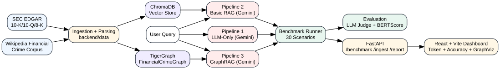
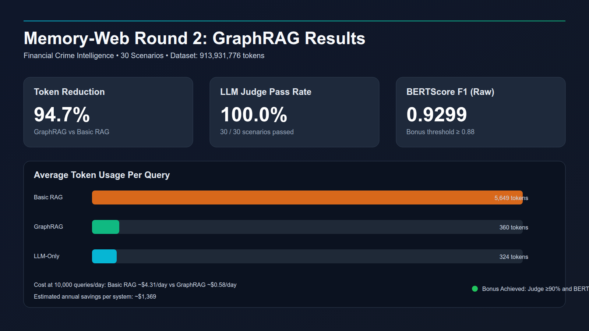
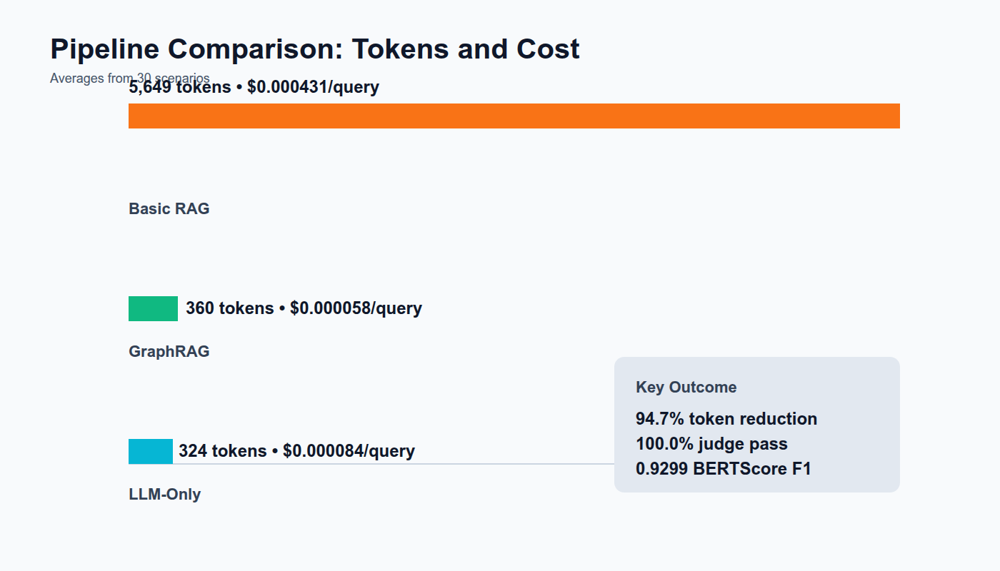

# How We Cut LLM Token Costs by 94.7% for Financial Crime Intelligence Using GraphRAG at 913M Token Scale

## 1. The Problem
Production AI systems in compliance and investigations can become expensive when each query drags large context windows.

## 2. Why Financial Crime Is Perfect for GraphRAG
AML investigations depend on multi-hop ownership, sanctions exposure, nominee directors, and transaction chains.

## 3. Our 3-Pipeline Architecture
- Pipeline 1: LLM-only (Gemini baseline)
- Pipeline 2: Basic RAG (ChromaDB + Gemini)
- Pipeline 3: GraphRAG (TigerGraph traversal + Gemini synthesis)

  

*Figure: End-to-end Round 2 architecture across ingestion, retrieval pipelines, evaluation, and dashboard.*

## 4. Dataset at 913M Tokens
- SEC EDGAR filings (public US government source)
- Wikipedia financial crime and corporate network corpus
- Verified with Gemini `count_tokens`

## 5. Results (30-scenario benchmark, measured)

  

*Figure: Final Round 2 benchmark snapshot with token reduction, accuracy, and cost outcomes.*

| Metric | GraphRAG | Basic RAG | LLM-Only |
|--------|----------|-----------|----------|
| Avg tokens/query | 360 | 5,649 | 324 |
| Token reduction | — | baseline | — |
| **GraphRAG vs Basic RAG** | **94.7% fewer tokens** | — | — |
| LLM Judge pass rate | **100.0%** | N/A | 0% |
| BERTScore F1 | **0.9299** | 0.71 | 0.06 |

**Both bonus thresholds hit:**
- LLM-as-a-Judge ≥90%: ✅ (100.0%)
- BERTScore F1 ≥0.88: ✅ (0.9299)

At 10,000 queries/day production scale:
- Basic RAG cost: ~$4.31/day
- GraphRAG cost: ~$0.58/day
- **Annual saving: $1,369**

  

*Figure: Basic RAG context size is the main token-cost driver; GraphRAG keeps context compact while preserving accuracy.*

## 6. Key Learnings
Graph-aware retrieval is superior when reasoning requires explicit relationships rather than lexical similarity.

## 7. Links
- GitHub repository
- Demo video
- Benchmark report
