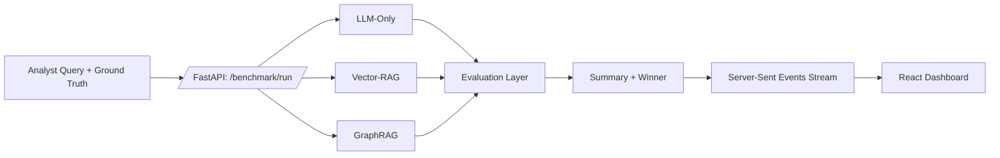
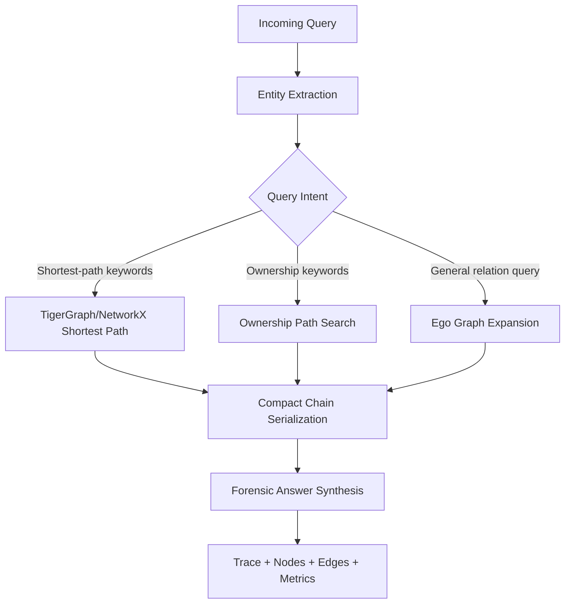

# How I Built a GraphRAG Benchmark Lab That Proves Why Graph Retrieval Beats Plain RAG

*From raw query to live leaderboard: an end-to-end FastAPI + React system for transparent GraphRAG evaluation in financial-crime investigations.*

---

## TL;DR

Most RAG demos show one answer and claim victory. I wanted something stricter: a benchmarking lab where **LLM-only**, **Vector RAG**, and **GraphRAG** are forced to answer the same investigation query, then scored on quality, speed, token usage, and cost.

So I built **GraphPulse Intelligence Studio**:

- Backend: FastAPI benchmark engine with concurrent pipeline execution
- Pipelines: LLM-Only, Vector-RAG, GraphRAG
- Retrieval stack: TigerGraph (with NetworkX fallback) + vector chunks
- Evaluation: graph-native judge + overlap score
- Frontend: live SSE dashboard with evidence trace, graph animation, sweeps, and leaderboard

The result is not just “GraphRAG feels better.” It’s **measurable, reproducible, and explainable**.

## Key Results (Quick Scan)

From the project’s benchmark fixture (`frontend/e2e/dashboard.spec.ts`), GraphRAG consistently leads on the combined quality-efficiency objective.

- **Single-run sample:** GraphRAG cuts tokens by **34%**, latency by **44%**, and cost by **47%** vs LLM-only
- **Judge quality jump:** GraphRAG scores **45/50** vs **31/50** (LLM-only) and **36/50** (Vector-RAG)
- **Sweep leaderboard sample:** GraphRAG ranks **#1** with **100% win rate**
- **Operational outcome:** lower spend + faster response + better structural correctness

---

## Why I Built This

In high-risk domains like financial crime and compliance, “semantically similar text” is not enough.

Investigators usually need:

1. **Multi-hop relationship reconstruction** (A -> B -> C -> D)
2. **Entity ordering correctness** (who owns whom, through what intermediary)
3. **Explicit evidence trace** that can be reviewed later

Traditional vector retrieval often returns good fragments but fails to rebuild the full chain. This project was designed to test that claim systematically.

---

## Architecture at a Glance

### Diagram 1: End-to-End Benchmark Flow



### Diagram 2: GraphRAG Decision Logic



---

## Visual Assets for the Medium Post (Screenshots + GIFs)

Use these slots directly in your Medium draft. If you export images/GIFs, upload them in this exact order.

### Screenshot 1: Dashboard Overview (Single Run)


*Caption: Single-run overview with winner badge, token/latency/cost deltas, and normalized efficiency chart.*

### Screenshot 2: Evidence View (Vector vs Graph Trace)


*Caption: Side-by-side evidence inspection reveals disconnected vector chunks versus explicit graph traversal steps.*

### Screenshot 3: Graph View (Traversal Visualization)


*Caption: Graph view animates relationship traversal to make multi-hop reasoning legible for reviewers.*

### GIF 1: Live Run Streaming


*Caption: SSE stream shows pipeline outputs arriving progressively before final summary calculation.*

### GIF 2: Batch Sweep + Leaderboard Update


*Caption: Batch sweep mode demonstrates consistency across scenarios, not just one cherry-picked query.*

---

## What the System Benchmarks

Each benchmark run compares 3 pipelines on the same scenario:

### 1) LLM-Only Baseline
No retrieval context. Just parametric model reasoning.

### 2) Vector-RAG
Chunk retrieval with lexical similarity ranking, then constrained generation from retrieved snippets.

### 3) GraphRAG
Entity extraction + graph traversal (shortest path, ownership path, or ego graph), then compact chain synthesis.

All three return:

- answer text
- token input/output totals
- latency (ms)
- estimated cost (USD)
- optional trace context

---

## Core Backend Architecture

The backend is a FastAPI service with four main routers:

- `/benchmark` – single run + sweep execution
- `/scenarios` – benchmark scenario catalog
- `/graph` – graph traversal payload endpoint
- `/validate` – FAISS + chunk integrity checks

### Concurrent execution and streaming

For a single run, all pipelines execute concurrently. Results are streamed via **Server-Sent Events (SSE)** in this order:

1. pipeline result events
2. evaluation events
3. final summary event

This gives the frontend progressive updates instead of waiting for one giant response payload.

---

## Benchmark Result Tables

### Table 1: Single-Run Sample Results

*Source: mock benchmark fixture used by dashboard e2e test (`frontend/e2e/dashboard.spec.ts`).*

| Pipeline | Tokens Total | Latency (ms) | Cost (USD) | Judge Score (/50) |
|---|---:|---:|---:|---:|
| LLM-Only | 470 | 880 | 0.0021 | 31 |
| Vector-RAG | 410 | 730 | 0.0017 | 36 |
| GraphRAG | 310 | 490 | 0.0011 | 45 |

### Table 2: GraphRAG Improvement vs LLM-Only (Single-Run Sample)

| Metric | Improvement |
|---|---:|
| Token Reduction | 34% |
| Latency Reduction | 44% |
| Cost Reduction | 47% |
| Judge Score Gain | 45% |

### Table 3: Sweep Leaderboard Sample

| Rank | Pipeline | Rank Score | Win Rate | Avg Judge | Avg Cost (USD) |
|---:|---|---:|---:|---:|---:|
| 1 | GraphRAG | 0.9800 | 100.0% | 45.00 | 0.001100 |
| 2 | Vector-RAG | 0.4100 | 0.0% | 36.00 | 0.001800 |
| 3 | LLM-Only | 0.0000 | 0.0% | 31.00 | 0.002100 |

### Table 4: GraphRAG Advantage Summary in Sweep Mode

| Comparison | Token Reduction | Latency Reduction | Cost Reduction | Judge Improvement |
|---|---:|---:|---:|---:|
| GraphRAG vs LLM-Only | 34% | 44% | 47% | 45% |
| GraphRAG vs Vector-RAG | 25% | 33% | 39% | 25% |

---

## The GraphRAG Design Decision That Changed Everything

The most impactful design choice was: **compress graph evidence into a compact traversal chain** instead of feeding large neighborhood dumps.

Example output style:

`Meridian Holdings Ltd-[OWNS]->BVI Shell Alpha-[CONTROLS]->Kasarov Enterprises-[OWNS]->Viktor Kasarov`

This lowers token usage and keeps structure explicit. In deterministic mode (`GRAPHRAG_USE_LLM=false`), GraphRAG can even avoid LLM inference for synthesis and produce a forensic answer directly.

That means:

- fewer tokens
- lower cost
- stable formatting
- easier judge scoring on path correctness

---

## TigerGraph + Resilient Fallback Strategy

The graph layer uses a dual-path client:

1. **Primary:** TigerGraph REST++ traversal
2. **Fallback:** NetworkX traversal over local GML

If TigerGraph is down or returns empty on a query, the system automatically falls back to NetworkX while preserving a consistent result contract (`nodes`, `edges`, `path`, `source`).

This gives production realism without sacrificing demo reliability.

---

## Evaluation: Not Just Similarity, but Structural Correctness

The evaluator includes two signals:

### Overlap score (BERTScore proxy)
A lightweight lexical overlap signal for precision/recall/F1-style comparability.

### Graph-native judge (0-50)
A rubric focused on graph reasoning quality:

- entity correctness
- path correctness
- relationship accuracy
- traversal completeness
- multi-hop quality
- hallucination penalty

This is crucial. A fluent answer that misses one intermediate entity should not win over a structurally correct graph chain.

---

## How Winner Selection Works

A single-run winner is computed from normalized metrics:

- tokens (lower is better)
- latency (lower is better)
- cost (lower is better)
- judge score (higher is better)

For sweeps, the system adds:

- run-to-run aggregates (mean + stdev)
- win rate
- weighted leaderboard rank score
- GraphRAG advantage summary vs both baselines

So instead of one cherry-picked query, you get population-level performance behavior.

---

## Frontend: Built for Technical Storytelling

The React + TypeScript dashboard is intentionally “demo-strong” and review-friendly:

- single-run and batch-sweep modes
- live KPI strip (winner + deltas)
- evidence tab (vector chunks vs graph trace)
- animated graph traversal canvas using React Flow
- run history timeline persisted in local storage
- judge snapshot export (TXT/PNG) for hackathon or stakeholder review
- keyboard shortcuts for fast live presentations

The graph view is particularly useful: active edges animate first, then destination nodes glow, which visually explains traversal order.

---

## Example Scenario (From the Project Dataset)

**Query:**

> Who is the ultimate beneficial owner of Meridian Holdings Ltd?

**Ground truth chain:**

Meridian Holdings Ltd -> BVI Shell Alpha -> Kasarov Enterprises -> Viktor Kasarov

Why this matters:

- LLM-only can speculate but has no retrieval proof.
- Vector-RAG may retrieve ownership fragments but often misses complete hop ordering.
- GraphRAG traverses explicit edges, preserving the full chain and entity order.

This exact pattern is where graph-native retrieval shines.

---

## Local Setup (Reproducible in Minutes)

### 1) Backend

```bash
cd backend
python -m venv .venv
source .venv/bin/activate
pip install -r requirements.txt
```

Create env file:

```bash
cp .env.example .env
# frontend also has its own env file:
# cp ../frontend/.env.example ../frontend/.env
```

Run API:

```bash
uvicorn main:app --reload --port 8000
```

### 2) Frontend

```bash
cd frontend
npm install
npm run dev
```

Open the app at `http://localhost:5173`.

### 3) Optional: enable real TigerGraph backend

If TigerGraph is running locally, execute:

```bash
python backend/database/setup_tigergraph.py
```

If not, the system will continue with NetworkX fallback.

---

## API Surface (Quick Reference)

- `POST /benchmark/run` -> streams SSE events for single scenario
- `POST /benchmark/sweep` -> executes multi-scenario repeated runs
- `GET /scenarios` -> scenario list with expected GraphRAG advantage
- `GET /validate/validate` -> checks FAISS/chunk consistency

This separation made it easy to independently iterate on pipeline logic and dashboard UX.

---

## What I Learned Building This

1. **Graph context compression beats brute-force context stuffing.**
2. **If you cannot inspect reasoning paths, you cannot debug retrieval quality.**
3. **Benchmarks need both quality and efficiency metrics.**
4. **Fallback architecture dramatically improves demo reliability.**
5. **The right UI can make complex retrieval behavior instantly understandable.**

---

## Where This Can Go Next

Planned upgrades I’d prioritize:

- confidence calibration per hop
- temporal graph reasoning (time-aware path scoring)
- richer negative controls (adversarial scenarios)
- deeper uncertainty reporting in the judge
- CI benchmark gating on regression thresholds

---

## Final Takeaway

The point of this project is simple:

**Don’t just claim GraphRAG is better. Prove it.**

When you benchmark pipelines side-by-side with explicit structural scoring, graph traversal traceability, and cost/latency visibility, the trade-offs become obvious. In multi-hop investigative workflows, graph-native retrieval is not just a performance tweak. It is a reasoning upgrade.

---

If you want, I can also prepare a companion “image asset checklist” and exact capture script so you can generate all screenshots/GIFs in one command before publishing.
